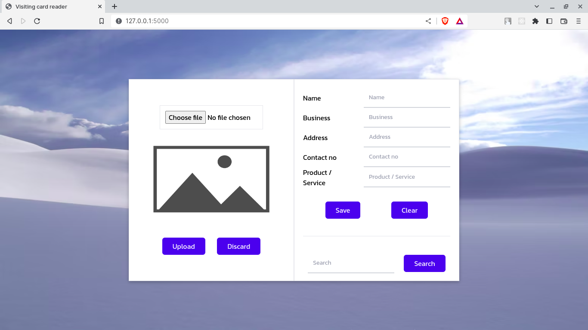

# Visitiing Card Reader

### A Visiting Card reader which can read a visiting card and extract all the details from it like name, company, address. Option for correction of the details is also provided. Built using vanilla javascript, express, tailwind



<br/>

## How to Start ?

<br/>

### 1. Install dependencies

```sh
npm install
```

### 2. Start project using below command

```sh
npm start
```

### App will be started at http://127.0.0.1:5000
